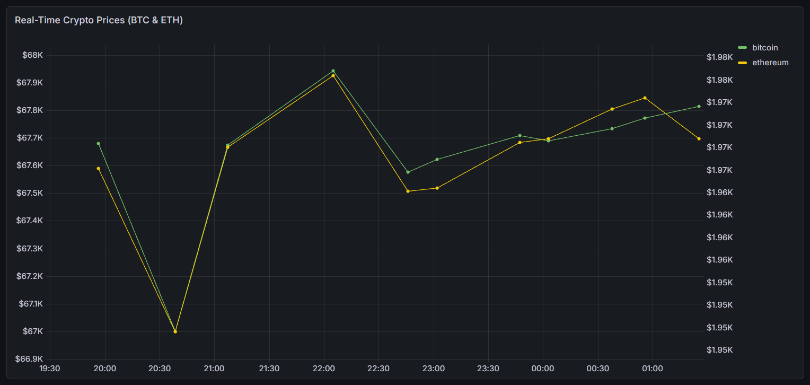

# 🚀 Automated Crypto ETL Pipeline & Real-Time Dashboard


## 📌 Project Overview
This project is an automated, cloud-native **Extract, Transform, Load (ETL) pipeline** that tracks cryptocurrency prices (Bitcoin & Ethereum) in real-time. The data is fetched from a public API, processed via a Dockerized Python environment, securely loaded into a cloud-based PostgreSQL database, and visualized using a live Grafana dashboard.

### 🟢 Live Real-Time Dashboard
Click the link below to view the live dashboard updating in real-time:
**👉 [View Live Grafana Dashboard Here](https://husniyeserrabosun.grafana.net/public-dashboards/a73da87db59e4b2591ceef17a9dab288)**

### ✨ Live Dashboard Preview


## 🏗️ System Architecture
The pipeline is designed with modern Data Engineering and Cloud computing principles:

1. **Extract:** Python script fetches real-time BTC and ETH prices using `requests`.
2. **Transform:** Data is parsed and structured to match the relational database schema.
3. **Load:** Safely inserted into a **Supabase (PostgreSQL)** database using `supabase-py`.
4. **Automate:** **GitHub Actions** triggers the ETL script every 10 minutes (Cron Job), ensuring continuous data flow without manual intervention.
5. **Monitor:** **Grafana Cloud** is directly connected to the Supabase Connection Pooler to visualize the time-series data in real-time.

## 🛠️ Tech Stack
* **Language:** Python
* **Containerization:** Docker
* **Database:** PostgreSQL (Supabase)
* **Automation/CI-CD:** GitHub Actions
* **Visualization:** Grafana Cloud
* **Libraries:** `pandas`,`python-dotenv`, `requests`, `supabase`

## ⚙️ Local Setup & Run

If you want to run this pipeline on your local machine, follow these steps:

**1. Clone the repository:**
```bash
git clone [https://github.com/HusniyeSerraBosun/crypto-etl-project.git](https://github.com/HusniyeSerraBosun/crypto-etl-project.git)
cd crypto-etl-project
```
**2. Set up Environment Variables:**

Create a .env file in the root directory and add your Supabase credentials:
```bash
SUPABASE_URL=your_supabase_url
SUPABASE_KEY=your_supabase_api_key
```
**3. Run with Docker:**

Build and run the containerized application without worrying about local dependencies:
```bash
docker build -t crypto-etl .
docker run --env-file .env crypto-etl
```
